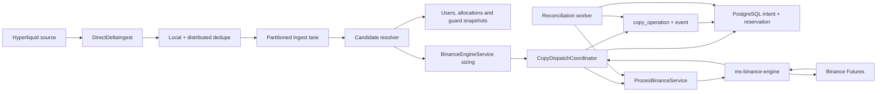
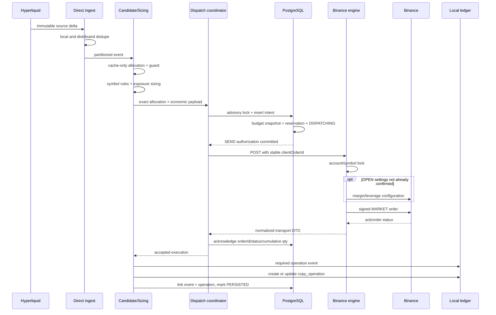
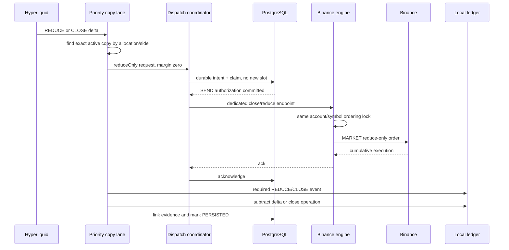
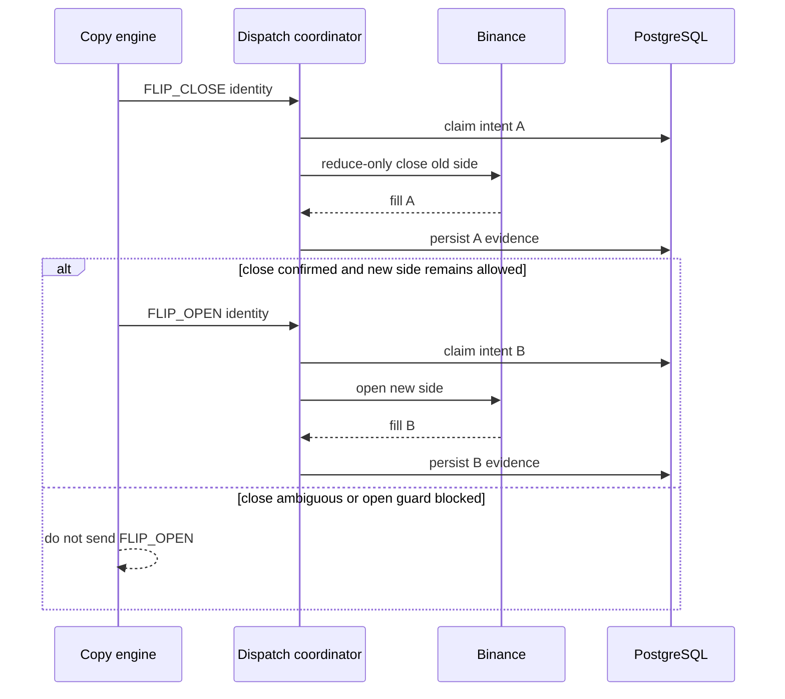
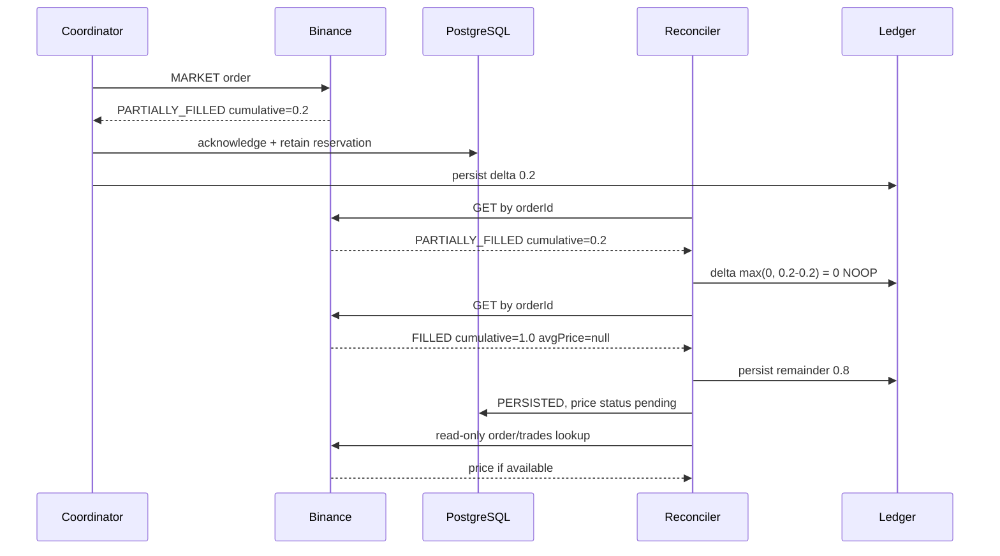
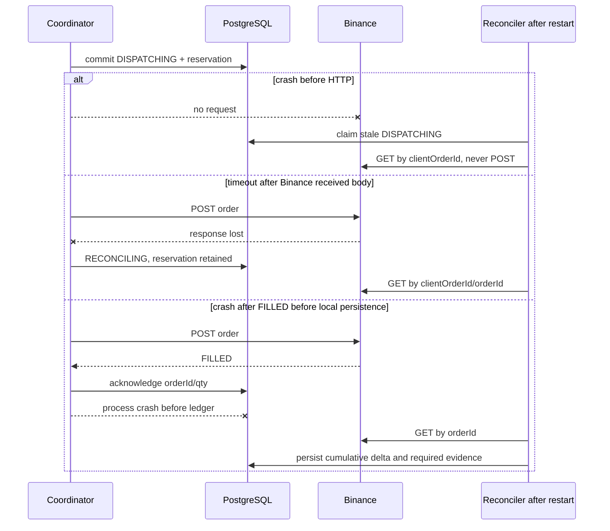
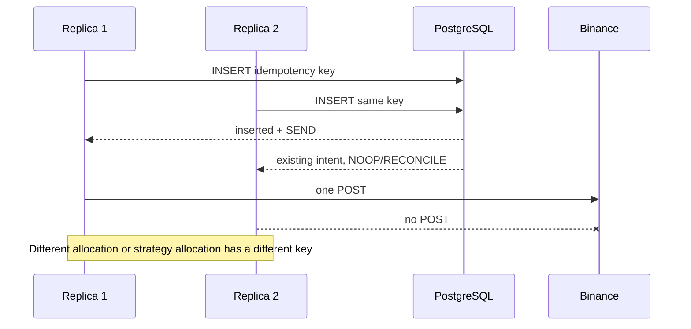

# SDD: Integridad y performance del camino real de copy trading

> Nota de precedencia (2026-07-13): los contratos de performance, intents y
> reconciliacion siguen vigentes. Cualquier monto fijo por operacion o limite
> global de posiciones fue sustituido por
> `copy-trading-proportional-portfolio-v3-sdd.md`.

Estado: aprobado para implementacion incremental
Fecha: 2026-07-10
Servicios: `ms-signals-orc`, `ms-binance-engine`
Alcance: `MICRO_LIVE` y `LIVE`
Prioridad: integridad financiera > latencia > throughput

## 1. Problema

El sistema debe transformar un movimiento de Hyperliquid en, como maximo, un
efecto economico real por allocation. PostgreSQL y Binance no ofrecen una
transaccion distribuida, por lo que no se declara exactly-once. El contrato es:

```text
at-most-one send authorization
+ identidad durable por intencion
+ clientOrderId estable
+ persistencia acumulativa de fills
+ reconciliacion de resultados ambiguos
= un efecto economico unico observable por allocation
```

La latencia se optimiza solo despues de demostrar que no se eliminan la reserva,
el claim durable, el ledger requerido ni la recuperacion posterior a un crash.

## 2. Contexto e incidente anterior

Una orden `FILLED` con `orderId` y `executedQty`, pero con `avgPrice=null`, fue
tratada como invalida. El pending estaba solo en memoria y un job reenvio la
misma intencion. Binance genero orderIds diferentes y se consumio mas margen que
el permitido. La correccion debe reconocer la ejecucion con esos tres datos,
resolver el precio despues y no reenviar.

La auditoria del 2026-07-10 encontro ademas ocho brechas:

1. El gate de ejecucion usa flags LIVE tambien para MICRO_LIVE y, al bloquear,
   fabrica un fill local tipo SHADOW. Una allocation real puede quedar persistida
   localmente aunque Binance nunca recibio una orden.
2. `UserDetailCachedServiceImpl` y `UserCopyAllocationServiceImpl` refrescan DB
   sincronicamente ante miss/TTL desde el hot path.
3. El agotamiento de reconciliacion usa `FAILED_FINAL`; no existe el estado
   explicito `MANUAL_REVIEW` exigido por el contrato operacional.
4. `copy_dispatch_intent.copy_operation_event_id` existe, pero no se asigna. Un
   intent puede marcarse `PERSISTED` sin probar el enlace al ledger requerido.
5. La resolucion inicial de candidatos es cache-only, pero
   `BinanceEngineServiceImpl.resolveAllocationContexts` vuelve a llamar
   `getCandidatesUser` y `getActiveAllocationsForUserWallet`. Ante cache miss,
   esas APIs pueden activar HTTP a metricas o una lectura PostgreSQL durante
   sizing. El contrato exige APIs explicitas cache-only por `user+wallet`, LKG
   para metricas ya primadas y fail-closed si cualquiera de los snapshots falta.
6. El ledger posee unicidad por progreso acumulado, pero el patron
   `precheck -> saveAndFlush -> catch unique -> select` no es seguro bajo una
   carrera: PostgreSQL aborta la transaccion que recibe `23505`. Se requiere un
   advisory transaction lock de granularidad
   `(dispatchIntentId,eventType,qtyExecuted,resultingQty)` antes del precheck.
   Ademas, al permitir varios progresos por intent se debe conservar una unique
   parcial para `clientOrderId` solo en eventos legacy sin `dispatch_intent_id`.
7. `ms-binance-engine` elimina dinamicamente locks de un mapa por cuenta+symbol.
   Entre la comprobacion `!isLocked/!hasQueuedThreads` y `remove`, otra hebra
   puede adquirir el lock viejo; una tercera crea uno nuevo y ambas ejecutan el
   mismo symbol en paralelo. Se elige un conjunto fijo y acotado de lock stripes:
   misma key siempre cae en el mismo lock, no hay remocion y el costo de memoria
   es constante. Colisiones entre keys distintas solo reducen paralelismo, nunca
   integridad.
8. La maquina `CopyDispatchStatePolicy` existe, pero inicialmente solo protegía
   claim y ambiguedad. `acknowledge`, rechazo, persistence-pending, persisted y
   mutaciones del reconciliador deben validar la transicion antes de guardar;
   probar la policy aislada no impide que un ack tardio sobrescriba un terminal.

## 3. Flujo actual observado

Camino real verificado en codigo:

1. `HyperliquidDirectDeltaIngestServiceImpl.accept` recibe un
   `HyperliquidMappedDelta`, crea la dedupe key, aplica dedupe Caffeine y guard
   distribuido y encola por lane.
2. El worker enlaza el origin mediante
   `HyperliquidOriginPositionStoreService.bindOriginIdForCopy` y llama a
   `HyperliquidDirectCopyDispatchServiceImpl.dispatch`.
3. `HyperliquidCopyCandidateResolver` obtiene usuarios, allocations de la wallet,
   filtra estrategia/scope y consulta `CopyStrategyGuardRuntimeCache`.
4. El dispatcher elige lane standard o priority. CLOSE, FLIP y RESIZE usan
   priority. Cada usuario se ejecuta con `BinanceEngineServiceImpl`.
5. `BinanceEngineServiceImpl` resuelve allocation exacta, simbolo, reglas del
   contrato, capital, exposicion, leverage, notional, margen y quantity.
6. `CopyDispatchCoordinator` valida el request, crea identidad/hash y llama a
   `PostgresCopyDispatchIntentStore.acquire`.
7. `acquire` toma advisory transaction lock por
   `(user, allocation, executionMode)`, inserta idempotentemente, calcula budget
   MICRO_LIVE, reserva y deja `DISPATCHING` antes de retornar.
8. Fuera de la transaccion se invoca `ProcesBinanceServiceImpl`, que usa un POST
   hacia `ms-binance-engine`. OPEN/INCREASE usan `/position`; reductions/closes
   MARKET usan el endpoint dedicado de cierre.
9. `ms-binance-engine` serializa por `(apiKey hash, symbol)`, reutiliza cliente
   HTTP, evita margin/leverage en reduce-only y llama a Binance Futures.
10. La respuesta vuelve y `BinanceOrderExecutionNormalizer` clasifica NEW,
    PARTIALLY_FILLED, FILLED, rechazo o ambiguedad.
11. El intent guarda orderId/status/qty/precio. El flujo de negocio persiste
    `copy_operation_event` requerido y `copy_operation`, y marca `PERSISTED`.
12. `CopyOrderReconciliationWorker` reclama con `FOR UPDATE SKIP LOCKED`, busca
    primero por orderId y luego clientOrderId, aplica solo el delta acumulativo y
    nunca llama al endpoint de envio.

## 4. Diagrama de componentes



## 5. Secuencias productivas

### 5.1 OPEN e INCREASE



INCREASE usa otro `copyIntent`, no reserva un slot nuevo y conserva el mismo
flujo durable. LIVE usa exposicion fuente; MICRO_LIVE usa sus topes propios.

### 5.2 REDUCE y CLOSE



Una reduccion no aumenta exposicion, pero sigue necesitando intent durable e
idempotencia. El lock por simbolo preserva orden frente a OPEN/INCREASE.

### 5.3 FLIP



Las dos piernas tienen claves, reservations y estados independientes. Nunca se
abre el lado nuevo basandose en un cierre ambiguo.

### 5.4 PARTIALLY_FILLED y FILLED sin avgPrice



`avgPrice=null` nunca cambia el derecho de send. Puede usarse referencePrice
provisional para reconstruccion, con status explicito.

### 5.5 Timeout y crashes



No existe resend automatico en ninguna rama. Un intent durable antes de HTTP
puede quedar manual si Binance nunca lo vio: la ausencia no se prueba con
suficiente certeza para autorizar otro efecto automaticamente.

### 5.6 Rechazo, cancelacion y expiracion

```mermaid
sequenceDiagram
  participant R as Coordinator/Reconciler
  participant B as Binance
  participant P as PostgreSQL
  participant L as Ledger
  B-->>R: terminal status + cumulative qty
  alt executedQty = 0 and definitive terminal
    R->>P: REJECTED + RELEASED
  else executedQty > 0
    R->>L: persist only new cumulative delta
    R->>P: keep economic effect; confirm residual state
  else malformed or transport cannot prove outcome
    R->>P: RECONCILING/MANUAL_REVIEW + PENDING reservation
  end
```

`CANCELED`, `EXPIRED` o incluso una respuesta anomala `REJECTED` con qty positiva
conservan el fill por integridad.

### 5.7 Replay del mismo source event



## 6. Hot path exacto

El hot path termina al iniciar el request ORC -> Binance engine. Incluye:

```text
ingest dedupe -> queue -> origin binding -> candidate snapshot -> guard snapshot
-> strategy routing -> user lane -> sizing -> symbol rules -> durable claim/reserve
-> payload construction -> HTTP start
```

No incluye reconciliacion, reporting, ranking, full simulation ni refresh remoto.
Una miss de users/allocations/guard debe bloquear con reason code o usar LKG no
vencido segun politica. Nunca debe ejecutar DB/HTTP sincrono desde esa miss.

El mismo contrato aplica a toda resolucion repetida dentro de
`BinanceEngineServiceImpl`: no basta con que `HyperliquidCopyCandidateResolver`
sea cache-only. Las APIs runtime autorizadas son
`getCandidatesForUserWalletCachedOnly` y
`getActiveAllocationsForUserWalletCachedOnly`; sus variantes con loader quedan
reservadas para jobs/control plane.

## 7. Unidad de aislamiento

La unidad es:

```text
user + user_copy_allocation_id + execution_mode + strategy + scope
+ immutable source event + copy intent
```

No se deduplica por wallet. El mismo evento puede producir un efecto en dos
allocations diferentes. MOVEMENT_ALL y LONG_ONLY/SHORT_ONLY son independientes
si sus allocations son distintas.

## 8. Invariantes financieras

`I01` Un source event se envia una vez por allocation.

`I02` Dos allocations pueden enviar una vez cada una.

`I03` La allocation y estrategia forman parte de la identidad.

`I04` Dos replicas conceden un solo SEND.

`I05` Intent y reserva se confirman antes de HTTP.

`I06` Misma key implica mismo clientOrderId.

`I07` Misma key con payload distinto falla cerrado.

`I08` Replays ACK/PERSISTED nunca vuelven a enviar.

`I09` Ambiguedad nunca libera reserva ni reenvia.

`I10` FILLED con orderId y qty positiva se reconoce sin avgPrice/updateTime.

`I11` Partial aplica `max(0, cumulative - persisted)`.

`I12` Terminal con fill conserva el efecto; terminal sin fill libera.

`I13` Error de ledger/operation deja `PERSISTENCE_PENDING`.

`I14` `PERSISTED` exige operation aplicable, event requerido enlazado y progreso.

`I15` Reconciliacion solo ejecuta GET/read-only, nunca POST de creacion.

`I16` `MANUAL_REVIEW` no autoriza send ni libera reserva ambigua.

`I17` No existe panic-close por fallo de persistencia.

`I18` Gate bloqueado no fabrica fills ni operaciones locales reales.

`I19` Deshabilitar dispatch no deshabilita reconciliacion.

`I20` MICRO_LIVE y LIVE no comparten kill switch de modo.

## 9. Idempotencia y clientOrderId

Clave canonica versionada:

```text
sha256(v1|user|allocation|mode|strategy|scopeType|scopeValue|
       sourceEventIdentity|copyIntent)
```

El request hash representa exclusivamente la orden ejecutable y la politica
inmutable del primer claim: symbol, side, positionSide, orderType, qty,
orderPrice, timeInForce, leverage, userMaxConcurrentPositions,
reservePosition, reduceOnly, configureSettings y clientOrderId. BigDecimal se
canoniza con `stripTrailingZeros().toPlainString()`.

`requestedMarginUsd`, `requestedNotionalUsd` y `referencePrice` son evidencia
economica derivada para presupuesto, auditoria y reconciliacion. En una orden
MARKET pueden variar entre replays aunque la orden Binance sea exactamente la
misma, por lo que no forman parte del request hash. El intent durable conserva
los valores calculados en el primer claim y un replay nunca vuelve a reservar
presupuesto ni autoriza un segundo send.

Un cambio en qty, precio LIMIT, lado, tipo, leverage o politica de posiciones
continua siendo `BLOCK_PAYLOAD_MISMATCH`. Un cambio aislado de precio de mercado,
margen o notional estimado debe reutilizar/reconciliar el intent existente de
acuerdo con su estado durable, sin generar conflicto y sin reenviar una orden
terminal.

El clientOrderId se deriva de la key, es estable en restart y cumple limite de
36 caracteres. No se cambia para un replay.

## 10. Maquina de estados del dispatch intent

Mapeo real y objetivo:

| Estado conceptual | Estado persistido |
|---|---|
| CREATED | CREATED |
| CLAIMED/RESERVED/SENDING | DISPATCHING + reservation=PENDING |
| ACKNOWLEDGED open | NEW |
| PARTIAL | PARTIALLY_FILLED |
| FILLED pending local | FILLED/PERSISTENCE_PENDING |
| RECONCILIATION_PENDING | RECONCILING |
| PERSISTED | PERSISTED |
| REJECTED/RELEASED | REJECTED + RELEASED |
| MANUAL_REVIEW | MANUAL_REVIEW + PENDING/CONFIRMED segun efecto |

Transiciones autorizadas:

```text
CREATED -> DISPATCHING | REJECTED
DISPATCHING -> NEW | PARTIALLY_FILLED | FILLED | RECONCILING | REJECTED
NEW -> RECONCILING | PARTIALLY_FILLED | FILLED | REJECTED | MANUAL_REVIEW
PARTIALLY_FILLED -> RECONCILING | PARTIALLY_FILLED | FILLED | MANUAL_REVIEW
FILLED -> PERSISTENCE_PENDING | PERSISTED | MANUAL_REVIEW
PERSISTENCE_PENDING -> RECONCILING | PERSISTED | MANUAL_REVIEW
RECONCILING -> NEW | PARTIALLY_FILLED | FILLED | REJECTED | MANUAL_REVIEW
PERSISTED -> PERSISTED
REJECTED -> REJECTED
MANUAL_REVIEW -> MANUAL_REVIEW
```

Son invalidas `PERSISTED/REJECTED/MANUAL_REVIEW -> DISPATCHING`, cualquier
disminucion de cumulative qty y cualquier release de outcome ambiguo.

## 11. Maquina de estados Binance

| Respuesta | Interpretacion |
|---|---|
| NEW + orderId | aceptada, no ejecutada, reconciliar |
| PARTIALLY_FILLED + qty>0 | aplicar delta, mantener reserva residual |
| FILLED + qty>0 | ejecucion reconocida |
| CANCELED/EXPIRED + qty>0 | fill terminal, conservar efecto |
| REJECTED + qty>0 anomalo | conservar fill, alerta de integridad |
| terminal + qty=0 | rechazo definitivo, liberar |
| sin orderId / parse incompleto | ambiguo, reconciliar |
| timeout/5xx posible post-send | ambiguo, reconciliar |

## 12. Maquina de persistencia

```text
ACK durable
-> aplicar delta en copy_operation
-> insertar/obtener copy_operation_event requerido
-> asociar event id e operation id al intent
-> actualizar persisted_executed_qty
-> PERSISTED o PARTIALLY_FILLED
```

Los pasos requeridos deben compartir transaccion cuando el flujo lo permita. Si
un paso ya comprometido existe tras crash, la recuperacion usa sus claves unicas
y continua sin aplicar el delta de nuevo.

## 13. Reservas MICRO_LIVE

Unidad: `(id_user, allocation_id, MICRO_LIVE)`.

```text
requestedMargin <= configured max per order (20 USDC default)
activeMargin + pendingMargin + requestedMargin <= allocation budget (100 default)
openPositions + reservedNewSlots <= 5 default
```

El advisory lock serializa snapshot y reserva. Pending, ambiguous y partial
consumen budget. Rechazo definitivo sin fill libera. El balance de cuenta no
reemplaza el budget. Leverage cambia notional, no el margen limite.

## 14. Contrato LIVE y sizing

LIVE no hereda 20/100/5. Requiere exposure fuente valida, capital propio valido,
side consistente y reglas Binance (step, min qty, min notional y max qty). Una
exposure faltante, stale sin politica o no positiva bloquea antes del claim. No
se usa fallback MICRO_LIVE ni llamada a metricas/full simulation en hot path.

## 15. Leverage y margin type

Binance configura leverage por cuenta + symbol, no por allocation. Por ello una
misma cuenta/symbol no puede representar simultaneamente dos leverages por
allocation. La politica elegida es cachear solo configuraciones confirmadas,
serializar por cuenta/symbol y configurar fuera del camino cuando sea posible.
Un mismatch no confirmado bloquea o ejecuta la configuracion explicita antes de
OPEN; reduce-only nunca cambia leverage. No se hace ningun cambio real durante
tests/auditoria.

## 16. Kill switches

| Variable | Efecto |
|---|---|
| `COPY_MICRO_LIVE_ENABLED` | autoriza/bloquea modo MICRO_LIVE |
| `COPY_LIVE_ENABLED` | autoriza/bloquea modo LIVE |
| `COPY_NEW_DISPATCH_ENABLED` | master para nuevos POST de orden |
| `COPY_RECONCILIATION_ENABLED` | controla solo worker read-only/recovery |

Todo bloqueo real lanza skip fail-closed. No devuelve un mock FILLED. Los flags
son independientes; apagar dispatch conserva reconciliacion.

## 17. Contrato HTTP

Los clientes se reutilizan con keep-alive. No se crea HttpClient por request. No
hay retry automatico de POST. Timeout/connect reset/5xx luego de posible envio
son ambiguos. Los GET de reconciliacion pueden reintentarse con backoff. Los
timeouts deben separar OPEN y CLOSE y se validan con servidor HTTP local.

## 18. Reconciliacion

El worker usa batch, lease y `FOR UPDATE SKIP LOCKED`; orderId primero y
clientOrderId como fallback. Un item no detiene el resto. Solo aplica delta
acumulativo y puede completar precio. Al agotar intentos usa `MANUAL_REVIEW`.
Outcome ambiguo conserva reservation=PENDING; precio pendiente con efecto ya
persistido puede conservar reservation=CONFIRMED.

## 19. Recuperacion tras crash

Se inyectan fallos antes/despues de intent, reserve, HTTP, ack, operation, event,
marca PERSISTED y durante partial/reconciliation. El restart debe recuperar por
intent durable, no por RAM. Ninguna ruta de recovery llama `operationPosition`,
`openPosition` o `closePositionMarket`.

## 20. Contrato de performance

Puntos monotonic clock:

| Punto | Evento |
|---|---|
| T0 | movimiento recibido |
| T1 | normalizacion completa |
| T2 | allocations resueltas |
| T3 | guards resueltos |
| T4 | sizing completo |
| T5 | intent reclamado |
| T6 | reserva confirmada |
| T7 | payload construido |
| T8 | HTTP ORC iniciado |
| T9 | Binance engine recibe |
| T10 | request Binance iniciado |
| T11 | respuesta Binance recibida |
| T12 | normalizacion completa |
| T13 | persistencia local completa |
| T14 | evento confirmado |

Timers no mezclan red externa y CPU/DB local.

## 21. Presupuesto de latencia

| Segmento | p50 | p95 | p99 |
|---|---:|---:|---:|
| local pre-dispatch T8-T0 | <10 ms | <25 ms | <50 ms |
| cache allocation+guard | <1 ms | <3 ms | <5 ms |
| claim+reserve | <3 ms | <10 ms | <20 ms |
| engine pre-network T10-T9 | <2 ms | <5 ms | <10 ms |
| post-ack persistence T13-T12 | <5 ms | <15 ms | <30 ms |

Incumplir no autoriza retirar controles. Se reporta el cuello por separado.

## 22. Throughput

Escalas: 1, 10, 50, 100, 300 y 1000 eventos. Matrices: wallet distinta/misma,
symbol igual, allocations distintas, replay exacto, 2/4 replicas, burst de
OPEN/INCREASE, mezcla REDUCE/CLOSE, NOOP, ambiguos, Binance/DB lentos y pool bajo
presion. Se mide EPS, p50/p95/p99/max, CPU, heap, GC, threads, conexiones, lock
wait, duplicates evitados, reservations y backlog.

## 23. Baseline

Baseline local del 2026-07-10, Java 21 Temurin 21.0.11:

- `ms-signals-orc`: 390 tests verdes, 28.446 s Maven.
- CPU puro identity + budget: 20,000 muestras, p50 0.0040 ms,
  p95 0.0106 ms.
- 100 eventos x 2 estrategias: 0.1554 ms promedio por evento en la corrida.
- `ms-binance-engine`: 26 tests verdes, 15.883 s Maven.
- No existe aun baseline PostgreSQL real T5-T6 ni red Binance T10-T11; no se
  inventan percentiles.

## 24. Riesgos e hipotesis

Riesgos principales: mock fill en gate bloqueado, refresh DB sincrono, evento no
enlazado, estados terminales sobrescribibles, cache HTTP ilimitada, lock por
symbol bajo burst, timeout OPEN de 120 s en engine y cardinalidad de metrics por
symbol.

Hipotesis de optimizacion:

| ID | Hipotesis | Medida |
|---|---|---|
| H1 | snapshot cache-only elimina spikes de DB en T2 | cache hit/miss p95 |
| H2 | clientes/settings bounded conservan reuse sin heap ilimitado | heap/cache size |
| H3 | settings confirmados evitan 1-2 round trips por OPEN warm | pre-network/network |
| H4 | metrics sin symbol reducen series cardinality | series count |
| H5 | no tocar lock por symbol conserva orden financiero | lock wait + correctness |

## 25. Alternativas

Se rechaza retirar PostgreSQL antes de send, confiar solo en clientOrderId,
retry de POST, fire-and-forget, cache miss con llamada remota y liberar ambiguos.
Se pospone outbox transaccional hacia Binance porque no elimina la frontera
distribuida y agrega complejidad. Se mantiene claim corto y HTTP fuera de la
transaccion.

## 26. Diseno elegido

1. Gate de modo puro y testeable, cuatro switches y cero mock fill real.
2. Politica explicita de transiciones; `MANUAL_REVIEW` terminal sin send.
3. Ledger requerido retorna event id; el intent se marca PERSISTED solo con
   operation id y event id.
4. Snapshots users/allocations refrescados fuera del hot path; miss fail-closed.
5. Metrics de baja cardinalidad para claim, dispatch, persistence y reconcile.
6. Caches de clientes/settings con maximum size y TTL.
7. No se modifica sizing financiero ni serializacion cuenta/symbol sin evidencia.

## 27. Plan RED -> GREEN -> REFACTOR

RED cubre: gate bloqueado no simula, switches independientes, no source identity,
REJECTED con fill, transiciones terminales, event link requerido, MANUAL_REVIEW,
cache miss sin loader, caches bounded y no retry POST. GREEN aplica el cambio
minimo. REFACTOR elimina duplicacion solo despues de verde.

La matriz de 76 casos del requerimiento se conserva en el reporte final; cada
caso queda mapeado a test existente, nuevo o pendiente con razon.

## 28. Plan de benchmark

Suite separada de funcionales: identity/hash/clientOrderId, allocations 1/5/20/
100, guard hit/miss, sizing MICRO/LIVE, claim 1/10/100 threads, normalizacion,
persistencia y flujo OPEN/INCREASE/REDUCE/CLOSE. Componentes puros usan warmup y
percentiles reproducibles; PostgreSQL usa Testcontainers o instancia local
aislada. Nunca se apunta a produccion ni Binance real.

## 29. Plan de fault injection

Fakes/WireMock simulan DB timeout/deadlock/pool, connect/read timeout, reset tras
body, JSON truncado, 429/418/500, null price/time, partial repetido, lookup 404,
restart y cache vacia. Cada prueba verifica sends, reservation, estado, delta,
operation, event y necesidad de reconcile.

## 30. Observabilidad

Metrics obligatorias, sin wallet/user/allocation/symbol/order/client/source IDs
como labels:

```text
copy_event_ingest_duration
copy_candidate_resolution_duration
copy_runtime_guard_duration
copy_sizing_duration
copy_dispatch_claim_duration
copy_reservation_duration
copy_pre_network_duration
copy_binance_engine_duration
copy_binance_network_duration
copy_post_ack_persistence_duration
copy_end_to_end_duration
copy_reconciliation_duration
```

Counters: authorized, duplicate_noop, payload_conflict, ambiguous, rejected,
persisted, manual_review, reservation_rejected, reconciliation success/failure,
partial_progress e integrity_violation. Gauges se obtienen con queries agregadas
para pending/ambiguous/persistence/manual/oldest/reserved/backlog.

Labels permitidos: execution_mode, operation_type, result, reason_code y
source_platform, todos normalizados y acotados.

## 31. PostgreSQL

Las transacciones no abarcan HTTP. Se validan planes de insert/select, snapshot
budget, claim SKIP LOCKED, lookup order/client y progress event. Indices minimos:
unique idempotency, status+retry, allocation+reservation, clientOrderId,
binanceOrderId, sourceEvent y dispatch progress. Las queries de validacion son
read-only y usan `EXPLAIN (ANALYZE, BUFFERS)` solo en una base controlada.

## 32. Canary y rollback

Fase 1 audit-only; fase 2 una subcuenta MICRO_LIVE 20/100/5; fase 3 una
allocation LIVE con whitelist; fase 4 expansion gradual. Avanza solo con cero
duplicados/overallocation/replays, backlog estable y suites/DDL/EXPLAIN verdes.

Rollback: `COPY_NEW_DISPATCH_ENABLED=false`, mantener
`COPY_RECONCILIATION_ENABLED=true`, no borrar intents/operations/reservations.
Requiere restart mientras las properties no tengan refresh dinamico. Verificar
que authorized deja de crecer y reconciliation sigue drenando.

## 33. Criterios de aceptacion y evidencia

- Spec aprobada antes de codigo productivo.
- RED observado para cada correccion critica.
- Suites completas y package verdes en Java 21.
- `git diff --check` limpio, sin `.rej` ni conflictos.
- Migracion aditiva revisada y validacion SQL read-only.
- No existe ruta de send desde reconciler ni retry ciego.
- Hot path no ejecuta metric HTTP/full simulation/refresh sincrono.
- Kill switches independientes y gate sin fill simulado.
- PERSISTED enlaza operation, event y cumulative progress.
- Benchmarks separan local, PostgreSQL y Binance/network.
- Runbooks de canary, rollback y reconciliacion completos.

El estado final se elige conservadoramente entre `NOT_READY`, `AUDIT_ONLY`,
`MICRO_LIVE_CANARY_READY`, `LIVE_CANARY_READY` y `PRODUCTION_READY`. Sin EXPLAIN
y canary observada en ambiente objetivo no se declara `PRODUCTION_READY`.
